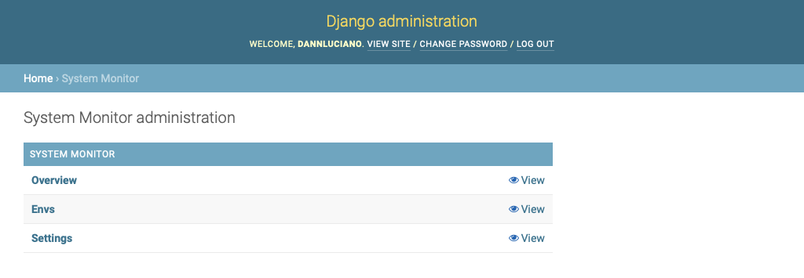

# Mini System Monitor

## Django Admin Pages for System Status

Only available for superusers.

-----------

1. Install django_mini_system_monitor with pip:

```shell
pip install django-mini-system-monitor
```

2. Add "mini_system_monitor" to your INSTALLED_APPS setting like this:

```python
    INSTALLED_APPS = [
        ...
        'mini_system_monitor',
    ]
```

3. Run ```python manage.py migrate``` to create the models.

4. Start the development server and visit http://127.0.0.1:8000/admin/ (you'll need the Admin app enabled).

```shell
    python manage.py runserver
```

# Screenshots

## Mini System Monitor Index Page


## Overview Page


## Envs Page


## Settings Page


## Authors

* **Dann Luciano** - *Initial work* - [@dannluciano](https://twitter.com/dannluciano)

See also the list of [contributors](https://github.com/dannluciano/django-mini-system-monitor/contributors) who participated in this project.

## License

This project is licensed under the MIT License - see the [LICENSE](./LICENSE) file for details

## Acknowledgments

Inspired:

* [django-sql-explorer](https://github.com/groveco/django-sql-explorer)
* and by Corona Virus

Thanks to [IFPI](https://www.ifpi.edu.br/) for pay my salary!

