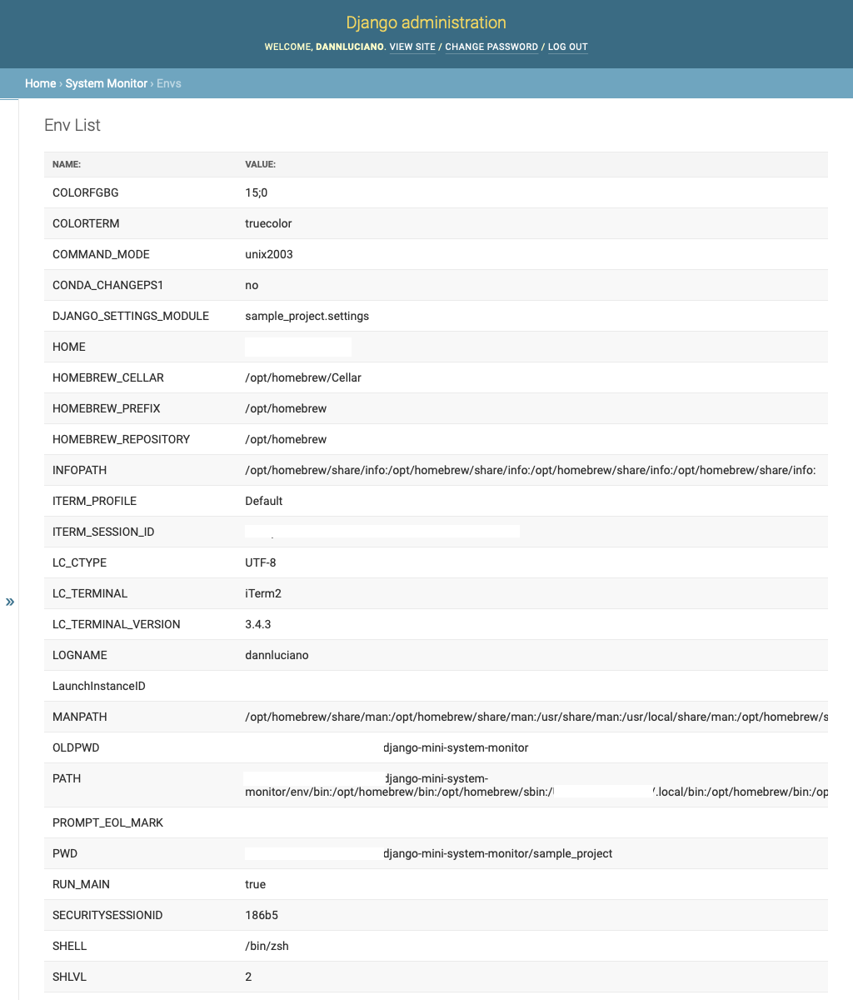

# Mini System Monitor

Generate Django Admin Pages for System Status

-----------

1. Install django_mini_system_monitor with pip:

```shell
pip install django_mini_system_monitor
```

2. Add "mini_system_monitor" to your INSTALLED_APPS setting like this:

```python
    INSTALLED_APPS = [
        ...
        'mini_system_monitor',
    ]
```

2. Run ```python manage.py migrate``` to create the mini-system-monitor models.

4. Start the development server and visit http://127.0.0.1:8000/admin/ (you'll need the Admin app enabled).

# Screenshots

## Mini System Monitor Index Page


## Overview Page


## Envs Page


## Settings Page
